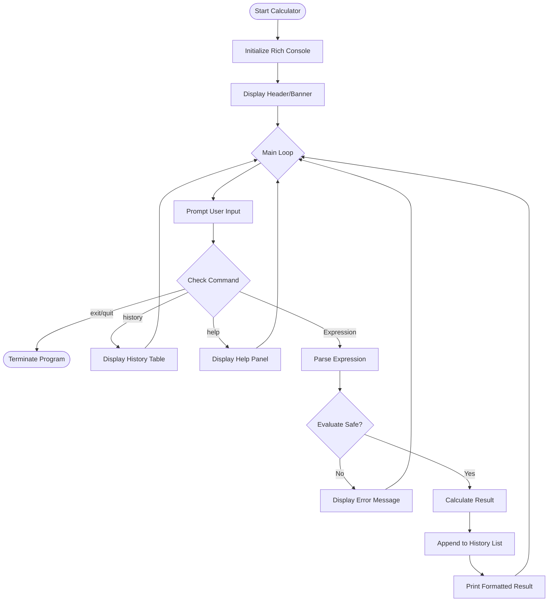

# Calculator System Architecture

This document outlines the architecture of the **CLI Calculator**, a Python-based utility enhanced with a Terminal User Interface (TUI).

## 1. Overview
The Calculator provides a text-based interface for performing arithmetic and scientific calculations. It leverages the `rich` library to deliver a visually appealing experience within the command line, featuring colored output, history tracking, and structured tables.

## 2. Technical Stack
*   **Language**: Python 3.8+
*   **UI Library**: `rich` (for formatting, tables, and colors)
*   **Core Libraries**: `math` (for scientific functions)

## 3. Module Design
The application is monolithic (`calculator.py`) but logically divided:

*   **Logic Layer**: Handling mathematical operations (add, sub, mul, div, pow, etc.).
*   **Presentation Layer**: Using `rich.console` and `rich.table` to render inputs and history.
*   **Input Handler**: A customized loop using `rich.prompt` to accept user expressions.

## 4. Execution Flow
The following diagram illustrates the application lifecycle:

## 5. Security Considerations
*   **Input Sanitization**: The calculator avoids `eval()` on unsafe strings where possible (or limits scope) to prevent arbitrary code execution, though for a local CLI calculation tool, standard python math evaluation is used.