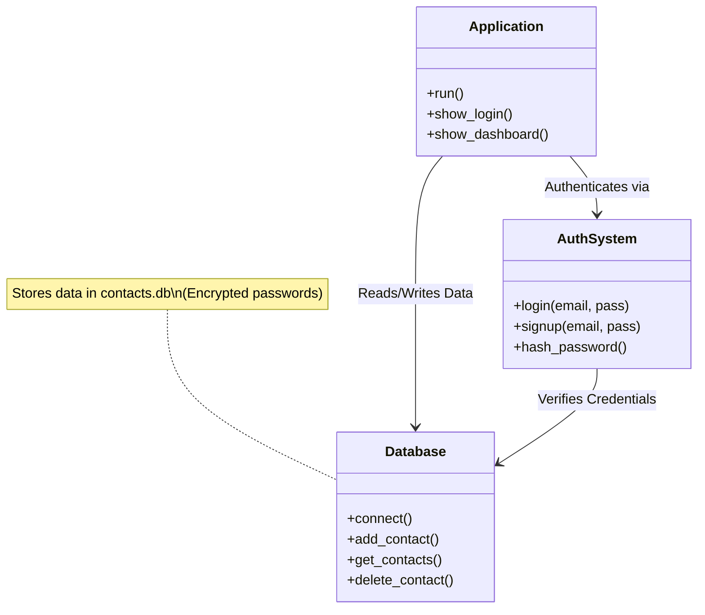
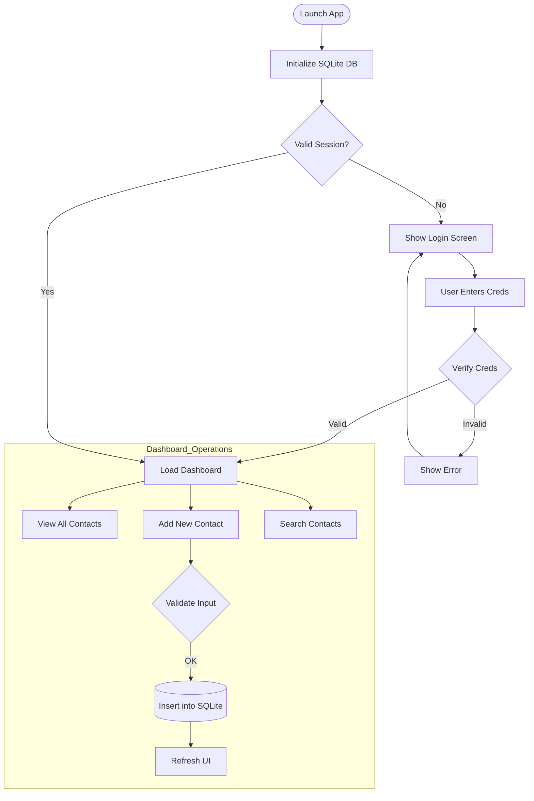

# Contact Book System Architecture

This document details the architecture of the **SmartConnect Contact Management System**, a desktop GUI application.

## 1. Overview
SmartConnect is a modern desktop application for managing contacts. It features a responsive graphical user interface built with `CustomTkinter`, uses `SQLite` for local data persistence, and includes secure User Authentication (Login/Signup).

## 2. Technical Stack
*   **Framework**: CustomTkinter (Modern wrapper around Python's Tkinter)
*   **Database**: SQLite3 (Local file persistence: `contacts.db`)
*   **Security**: `bcrypt` (Password hashing)
*   **Language**: Python 3.x

## 3. Architecture Components

### Frontend (UI Layer)
*   **MainWindow**: The primary container hosting navigation tabs.
*   **LoginWindow**: Dedicated UI for authentication.
*   **Forms**: Input fields for contact details (Name, Phone, Email, Address).
*   **ContactList**: Scrollable frame rendering contact cards.

### Backend (Logic Layer)
*   **AuthSystem**: Manages user sessions, hashing, and access control.
*   **DatabaseManager**: Abstraction layer for SQL queries (CRUD operations).

## 4. System Logic & Data Flow

