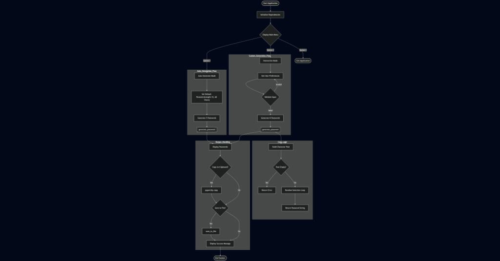

# Password Generator System Architecture

This document describes the system architecture and logical flow of the **Password Generator** application.

## 1. Overview
The Password Generator is a command-line interface (CLI) tool designed to create secure, random passwords based on user-defined criteria. It is implemented in Python as a standalone script.

## 2. Code Structure
The application is structured as a collection of modular functions orchestrating the user logic.

### Core Modules
*   **main()**: The entry point that handles the application loop and menu routing.
*   **generate_password()**: Core logic engine that constructs the password string using the `random` and `string` libraries.
*   **User Interface**: `display_menu()` and `get_password_preferences()` handle CLI input/output.
*   **Persistence**: `save_to_file()` handles writing the output to disk.
*   **Utilities**: `pyperclip` integration for clipboard operations.

## 3. Process Flowchart
The following Mermaid diagram illustrates the execution flow of the application:

## 4. Key Dependencies
*   **Python 3.x**
*   **Standard Libraries**: `random`, `string`, `os`
*   **External Libraries**: `pyperclip` (for clipboard access)