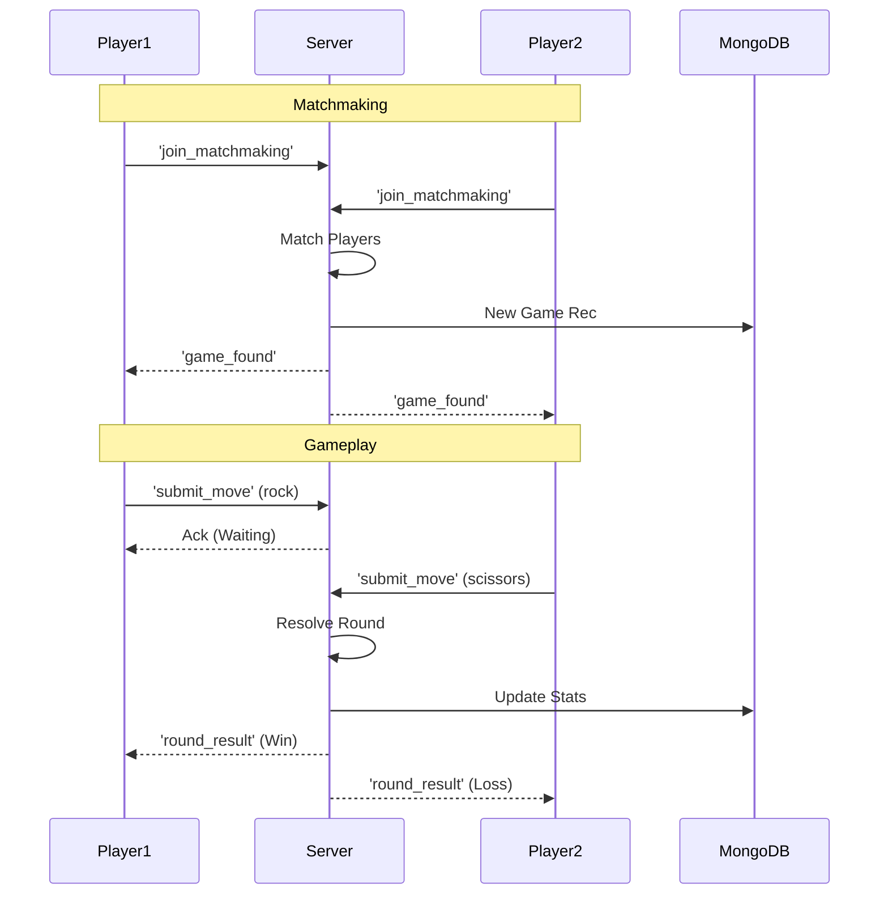
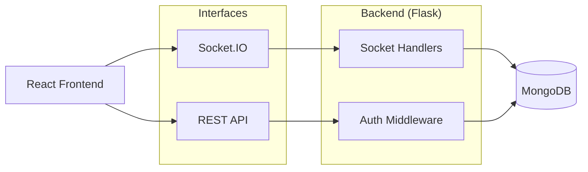

# Rock Paper Scissors - System Architecture

This document details the architecture of the **RPS Arena**, a realtime multiplayer gaming platform.

## 1. Overview
RPS Arena is a Full-Stack realtime web application. It enables users to play Rock-Paper-Scissors against the computer or other players online. It features live matchmaking, leaderboards, and persistent player statistics.

## 2. Technical Stack
### Frontend
*   **Framework**: React.js (Vite)
*   **Realtime Client**: `socket.io-client`
*   **Styling**: Tailwind CSS + Framer Motion (Animations)
*   **Auth**: Firebase Auth

### Backend
*   **Server**: Flask (Python) with `flask-socketio`
*   **Concurrency**: Eventlet / Threading (for Socket.IO)
*   **Database**: MongoDB (`rock_paper_scissors` db)
    - Collections: `users`, `games`, `leaderboard`

## 3. Realtime Architecture

## 4. System Component Diagram

