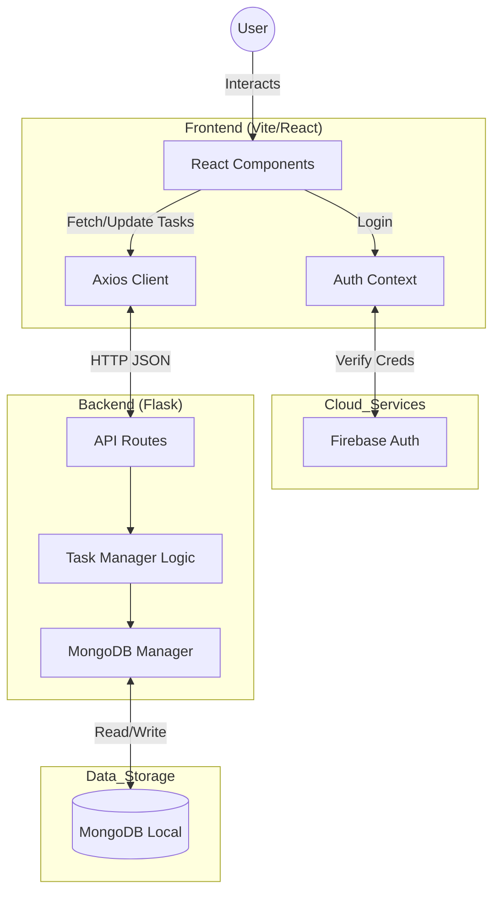

# TaskFlow (To-Do List) System Architecture

This document outlines the Full-Stack architecture of the **TaskFlow** application.

## 1. Overview
TaskFlow is a modern web application for task management. It utilizes a decoupled architecture with a React frontend and a Flask backend, communicating via REST APIs. Data is persisted in MongoDB (with JSON fallback), and authentication is handled by Google Firebase.

## 2. Technical Stack
### Frontend
*   **Framework**: React.js (Vite)
*   **Styling**: Tailwind CSS
*   **State Management**: React Context API
*   **Auth SDK**: Firebase JS SDK

### Backend
*   **Server**: Flask (Python)
*   **Database Interface**: PyMongo
*   **Communication**: REST API (JSON)
*   **CORS**: Flask-CORS enabled

### Database
*   **Primary**: MongoDB (Local `taskflow_db`)
*   **Collections**: `tasks`

## 3. Architecture Diagram

## 4. Key Data Flows
1.  **Authentication**: User logs in via Google (Frontend -> Firebase). Token is received.
2.  **API Requests**: Frontend sends User UID with requests.
3.  **Persistance**: Backend receives UID, queries MongoDB for tasks matching `{'user_id': uid}`.